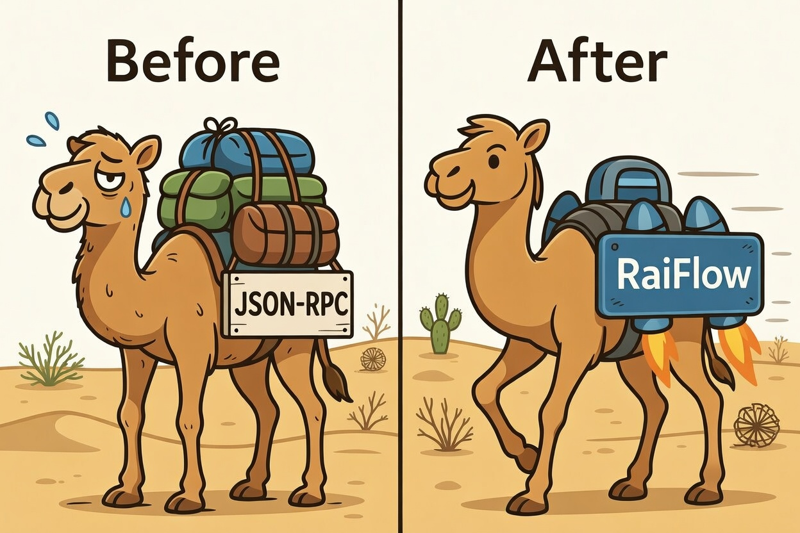

# RaiFlow

RaiFlow is the runtime layer [Nano](https://nano.org/) app developers should have had from the start.

Your app should not have to be thinking in terms of library calls that just map to raw Nano JSON-RPC. It should not be tracking confirmations itself, juggling WebSocket state, building blocks, managing frontiers, generating work, sweeping receivables, or inventing its own event plumbing every time.

RaiFlow sits between your app and one or more Nano nodes and turns that low-level mess into an application-facing runtime.



```text
YOUR APP -> RAIFLOW RUNTIME -> NANO NODE(S)
              |
              |- invoice domain
              |- wallet domain
              |- custody engine
              |- persisted events
              `- RPC failover + confirmations
```

## The Pitch

Without RaiFlow, applications often ends up owning too much Nano-specific machinery:

- raw JSON-RPC calls
- node failover and reconnect logic
- WebSocket confirmation handling
- account frontier tracking
- work generation and block publish flow
- receivable detection and receive flow
- payment matching and webhook plumbing

With RaiFlow, your app talks to a runtime that already understands those concerns:

- create invoices
- operate managed or watched accounts
- send XNO safely with idempotency
- publish pre-signed blocks
- subscribe to persisted events
- deliver webhooks from one place

The idea is simple: you build app logic. RaiFlow absorbs Nano runtime logic.

Adnan (عدنان), the Nano camel above, is the repo mascot for that shift.

## What RaiFlow Is

RaiFlow is a self-hostable Nano runtime for two jobs that belong together:

- getting paid
- operating a wallet

Those jobs map to two domains in one runtime:

- **Invoice domain**: create payment expectations, detect matching payments, manage lifecycle, and sweep funds
- **Wallet domain**: manage derived accounts, watch external accounts, send funds, publish pre-signed blocks, and generate work

Both domains share the same storage, event system, RPC layer, and custody engine.

RaiFlow is intentionally thin. It adds orchestration, persistence, event routing, and reliability guarantees. It does not try to become your catalog, checkout, customer database, or business logic layer.

## What It Is Not

RaiFlow is not:

- a consumer wallet UI
- a hosted gateway or SaaS product
- a Nano node
- a block explorer
- a fiat payments platform
- an e-commerce framework

## Why This Repo Exists

Nano has good settlement properties. What it does not have is an application runtime that cleanly separates:

- Nano protocol mechanics
- runtime orchestration
- application business logic

`@openrai/nano-core` handles Nano protocol primitives. RaiFlow handles the runtime concerns above that layer. Your app stays above both.

## Status

RaiFlow is in the middle of a v2 rebuild.

What is true today:

- The v2 foundation packages exist and build: `config`, `storage`, `events`, `rpc`, `custody`
- The daemon boots from `raiflow.yml`
- SQLite migrations run on startup
- The event store and event bus are implemented
- The RPC package has multi-node client/failover primitives
- The custody package has seed loading, derivation, signing, and work-generation primitives
- Account and send services are being wired through the runtime and SDK
- The current HTTP runtime still has some prototype-era route shape mixed into it

What is not true yet:

- The wallet domain is not fully exposed through the final runtime API
- The invoice domain has not yet been fully rebuilt on the new storage/custody stack
- The documented v2 route surface is not fully implemented end-to-end
- Hardening work like complete auth enforcement, restart recovery, and integration coverage is still ahead

If you are evaluating the repository today, the safest reading is:

> The runtime direction is set, the core packages are real, and the remaining work is connecting domain behavior cleanly through the public API.

## Current Runtime Surface

The runtime currently exposes a limited, transitional HTTP surface centered on the earlier invoice prototype:

- `GET /health`
- `POST /invoices`
- `GET /invoices`
- `GET /invoices/:id`
- `POST /invoices/:id/cancel`
- `GET /invoices/:id/payments`
- `GET /invoices/:id/events`
- `POST /webhooks`
- `GET /webhooks`
- `DELETE /webhooks/:id`

Treat this as in-progress runtime surface, not final product shape.

## Design Constraints

These are deliberate constraints, not marketing copy:

- self-hostable first
- idempotency on mutating operations
- persist-first events
- one runtime for invoice and wallet domains
- multi-node RPC instead of single-node dependence
- namespace separation for invoice and managed-account derivation
- framework-agnostic runtime API built on web `Request`/`Response`
- Nano protocol primitives delegated to `@openrai/nano-core`

## Repository Layout

```text
apps/site/            documentation site
packages/
  model/              canonical types and contracts
  config/             YAML config loader with env resolution
  storage/            SQLite adapter and migrations
  rpc/                Nano RPC + WebSocket primitives
  events/             event bus and persisted event access
  custody/            derivation, signing, PoW, frontier-related logic
  runtime/            HTTP runtime and orchestration
  webhook/            webhook signing and delivery
  raiflow-sdk/        typed JS/TS client
examples/             reference integrations
rfcs/                 architecture decisions
docs/                 progress and implementation notes
```

## Deployment Quickstart

The fastest way to run RaiFlow is with Docker Compose.

### Quick Start

1. Copy the example compose file (or use the one in the repository root):

```bash
cp docker-compose.yml docker-compose.override.yml
```

2. Start the container:

```bash
docker compose up -d
```

RaiFlow will boot, run SQLite migrations, and auto-generate an API key if you do not provide one.

### Required Environment Variables

| Variable | Required | Description |
|----------|----------|-------------|
| `NANO_RPC_URL` | **Yes** | Nano node RPC endpoint (e.g. `https://rpc.nano.org`) |
| `RAIFLOW_API_KEY` | No | API key for Bearer auth. Auto-generated if omitted. |
| `RAIFLOW_CUSTODY_SEED` | No | BIP39 seed for managed accounts. Only needed for wallet features. |
| `RAIFLOW_CUSTODY_REP` | No | Default representative for managed accounts. Only needed with custody. |

### Persistent Data

The `/data` volume persists two files across restarts:

- `raiflow.db` — SQLite database (WAL mode)
- `.api-key` — Auto-generated API key (only written when `RAIFLOW_API_KEY` is not set)

### Retrieving Your API Key

If you did not set `RAIFLOW_API_KEY`, the container generates one on first boot. Retrieve it with:

```bash
docker exec <container> show-api-key
```

Or read the file directly:

```bash
docker exec <container> cat /data/.api-key
```

### Port Binding & Security

RaiFlow is designed as an **app-private** service. **Do NOT forward port 3100 to the public internet.** The compose file binds to `127.0.0.1` so only local application code can reach it. The API key authenticates internal service requests, not public traffic.

### Custom Config

For advanced settings (webhooks, auto-sweep, multi-node RPC), mount your own `raiflow.yml`:

```yaml
services:
  raiflow:
    volumes:
      - ./my-raiflow.yml:/app/raiflow.yml:ro
```

## Running The Current Code

1. Install dependencies:

```bash
pnpm install
```

2. Create a config file:

```bash
cp raiflow.yml.example raiflow.yml
```

3. Fill in any environment variables referenced by the features you enable in `raiflow.yml`

   For the default example, none are required just to boot locally. `NANO_RPC_URL`,
   `NANO_WS_URL`, and `NANO_WORK_URL` are optional endpoint overrides. `RAIFLOW_CUSTODY_SEED` and
   `RAIFLOW_CUSTODY_REP` are only needed when you enable custody-backed features.

4. Build the workspace:

```bash
pnpm -r build
```

5. Run tests:

```bash
pnpm -r test
```

6. Start the runtime:

```bash
pnpm --filter @openrai/runtime start
```

## Repository Truth Sources

If you want the current state rather than the intended end state, read these first:

- `docs/progress.md` — current implementation frontier
- `ROADMAP.md` — milestone map
- `rfcs/0001-project-framing.md` — project framing and scope
- `rfcs/0003-event-model.md` — current v2 resource/event model

## Blunt Assessment

RaiFlow is no longer just an observe-mode prototype, but it is not yet a finished production runtime either.

The repo already contains the foundation needed for that runtime:

- typed config loading
- SQLite persistence
- migrations
- persisted events
- RPC primitives
- custody primitives

What remains is the hard part that matters most to users: finishing the domain services and exposing them coherently through the runtime API.

## Release Flow

RaiFlow uses a solo-developer Changesets flow for the public packages in this workspace:

- `@openrai/model`
- `@openrai/webhook`
- `@openrai/raiflow-sdk`

Those three published packages release in lockstep and share the same version on each repo release. `@openrai/nano-core` remains separate in its own repository and release line.

Local package development stays on `workspace:*` links, including the examples, so in-repo changes are exercised without publishing prereleases.

Typical release steps:

1. Add a changeset:

```bash
pnpm changeset
```

2. Apply the version bumps, create a release commit, and create one tag per bumped package:

```bash
pnpm release:version
```

3. Push the commit and tags:

```bash
git push && git push --tags
```

GitHub Actions then builds, tests, and publishes tagged packages from `.github/workflows/release.yml` using npm Trusted Publisher.
